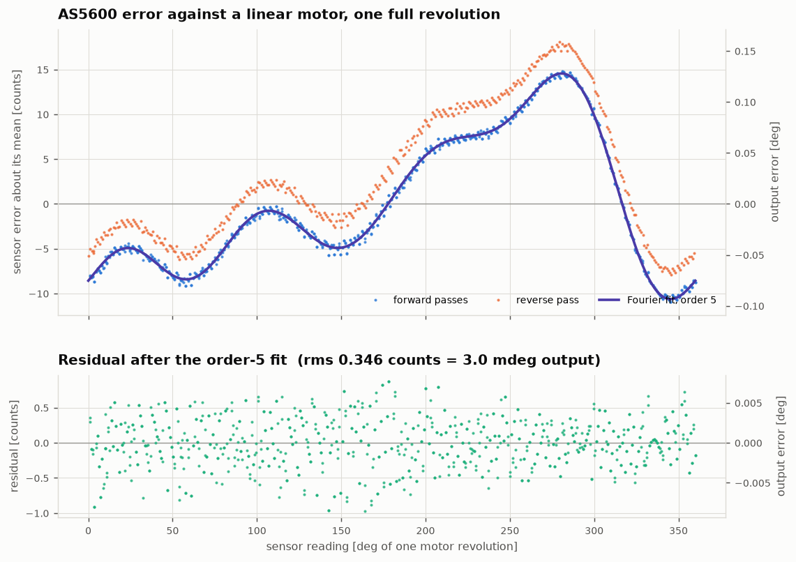
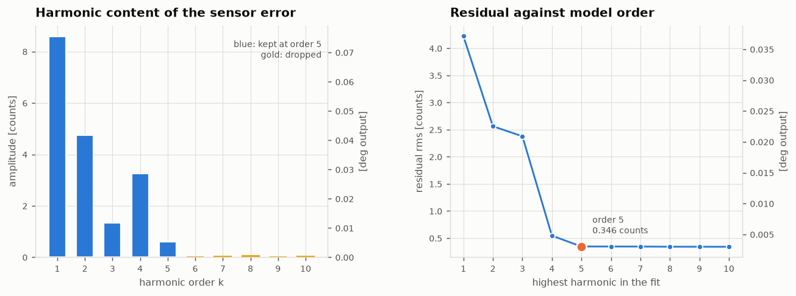
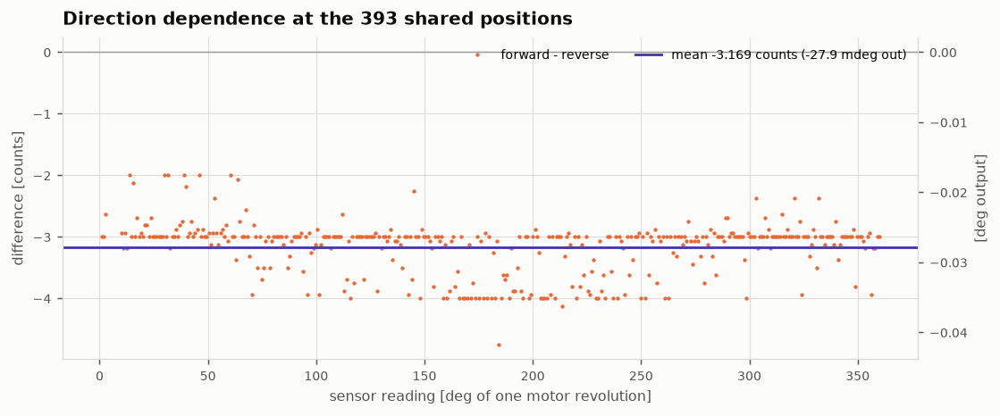
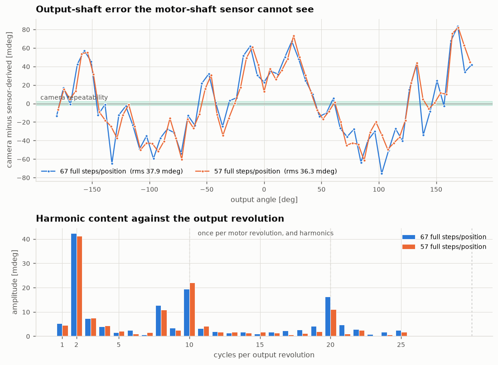
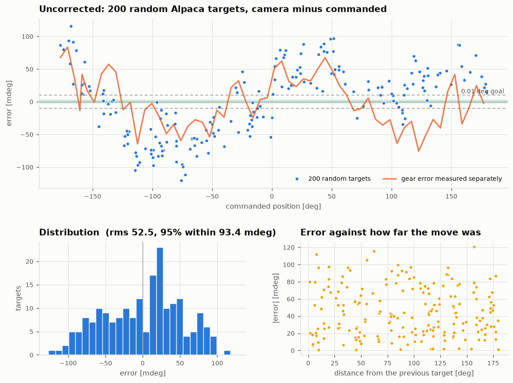
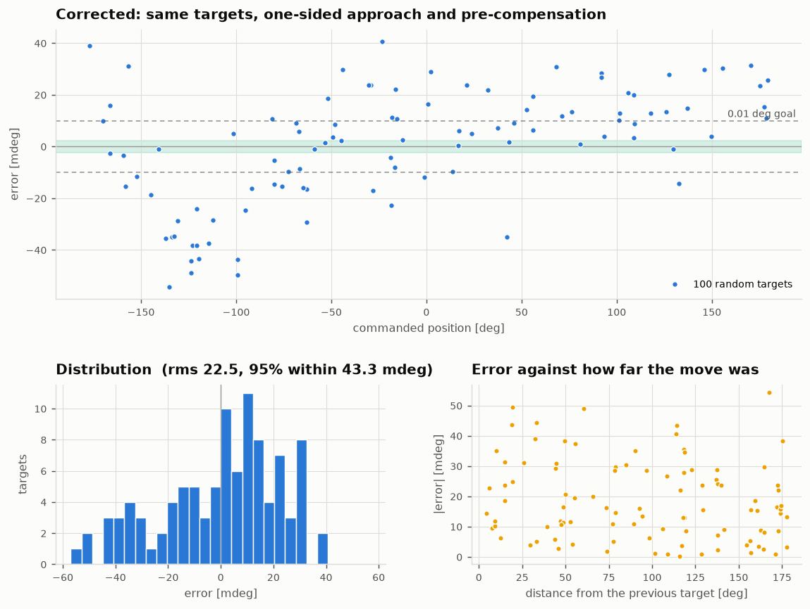

# Rotator angle accuracy: what was measured, 2026-09-18/19

A from-scratch calibration of the angle chain on the one unit, measured with
the output-shaft chessboard camera as an independent reference. Every number
here is live hardware; none is simulated.

## Summary

The firmware already positions the **motor shaft** to better than 0.01
degrees. Everything that stops the **output shaft** from getting there sits
downstream of the 10:1 reduction, where the AS5600 cannot see it.

| | |
|---|---|
| firmware closed loop, sensor against Alpaca target | **4.5 mdeg rms**, max 13 |
| what a user actually gets, 200 random targets | **52.5 mdeg rms**, max 120 |
| of which: direction-dependent, on random targets | 64 mdeg peak-to-peak |
| that, after a one-sided approach in firmware | 38.7 mdeg |
| lost motion on reversal, measured directly | ~89 mdeg |
| irreducible position hysteresis, any approach length | ~25-30 mdeg |
| of which: output error as a function of position | ~36 mdeg rms |
| after correcting for both, measured again | **22.5 mdeg rms**, max 54 |
| run-to-run repeatability of the position-dependent error | **10.7 mdeg** |

The last line is the hard floor: two independent sweeps of the same error
correlate at +0.955 but differ by 10.7 mdeg rms, of which 3.3 mdeg is camera
noise. About 10 mdeg of the mechanics simply does not repeat.

## Two firmware-level findings

**The AS5600's ANGLE register has a dead band at its wrap.** The chip applies
a documented ~10 LSB hysteresis at the limit of its 360-degree range.
Measured with a one-count fine sweep: travelling upwards the output stuck at
exactly 4095 for 275 microsteps - eleven counts of real motion reported as
none - then jumped straight to 11, while the same crossing downwards was
smooth. That is 0.105 output degrees per motor revolution carrying no
position information, and no smooth correction model can represent it.
`RotatorHW::readAngleSafe()` now reads RAW ANGLE (0x0C) instead. Verified on
the flashed build: thirty commanded one-count steps across the wrap advance
the sensor by 30.875 counts, against eleven counts of motion producing no
output at all before.

The fix paid twice. The raw register dithers by +/-1 LSB where the ANGLE
register's internal filtering suppressed it - at rest the old path returned
the identical integer twenty times in a row, so averaging bought nothing.
With dither, averaging yields real sub-count resolution, and forward
repeatability improved from 2.29 to 1.31 mdeg.

**The stored full-step table was actively harmful.** The 400-entry residual
table on the device spanned -17.4 to +22.8 counts - 353 mdeg peak to peak -
and had been fitted against the previous correction and the old register. It
was injecting up to 222 mdeg of drift. Cleared; the previous contents are in
`backup_fullstep_table.json`.

## Sensor characteristic

400 support points, one per full step, over exactly one motor revolution;
three passes (forward, reverse, forward).

| | |
|---|---|
| uncorrected error | 0.225 deg peak-to-peak |
| closure over one revolution | <= 0.5 counts - no lost steps |
| forward repeatability | 0.149 counts = 1.31 mdeg output |
| residual after the order-5 fit | 0.347 counts = **3.0 mdeg output** |
| direction hysteresis at the motor shaft | 3.17 counts = 27.9 mdeg, constant across the revolution |

Harmonic amplitudes in counts: k1 8.58, k2 4.75, k3 1.33, k4 3.27, k5 0.60,
and from k6 on 0.02-0.03 - noise. **Order 5 is where the data stops
improving**; order 7 buys 0.02 counts. The device's stored format is KMAX = 4
(`main/RotatorHW.h`), which costs 4.8 mdeg instead of 3.0; raising it is a
persistent-format change and was not done.

The fit reproduced across two sweeps taken hours apart to within a few
percent on every harmonic, so it is the machine's characteristic and not a
fit to noise.





## Control law

P, PI, PD and PID compared on the real machine over the same six targets,
4 mdeg tolerance:

| | final error rms | iterations |
|---|---|---|
| P | 2.26 mdeg | 1.5 |
| PI | 2.52 mdeg | 3.0 |
| PD | 2.20 mdeg | 2.3 |
| PID | 2.03 mdeg | 2.7 |

All four land in the same place; P gets there fastest. This is structural
rather than a matter of tuning: a commanded microstep *is* the movement, so
the plant has neither dynamics for a derivative term to damp nor a standing
offset for an integral term to remove. A small integral term still earns its
place against hysteresis, which is what the firmware already does.

## Microstepping is not worth modelling

One microstep is 4096/(400*256) = 0.04 sensor counts, so the AS5600 cannot
resolve one at all. It can be reached statistically: sample the same
microstep *phase* at many different full steps, where each sits at a
different sub-count offset, and the quantisation decorrelates across them.
961 points over 60 full steps, 16 phases each, against the corrected sensor:

| phase, of 256 | mean deviation |
|---|---|
| spread across all 16 phases | **1.73 mdeg peak-to-peak** |
| uncertainty per phase bin | 0.54 mdeg |

With sixteen bins at 0.54 mdeg each, a 1.7 mdeg spread is about what noise
alone produces. **The TMC2209's microstepping is linear to below 2 mdeg at
the output** - two orders of magnitude under the backlash and one under the
sensor model's own residual. There is nothing here worth correcting, and a
microstep model would be fitting noise.

## What the sensor cannot see

The AS5600 is on the motor shaft. Two sweeps over a full output revolution,
at deliberately different step spacings so neither run's aliasing could be
mistaken for signal:

| | run 1 | run 2 |
|---|---|---|
| rms | 37.9 mdeg | 36.3 mdeg |
| peak-to-peak | 159 mdeg | 144 mdeg |
| dominant harmonic (2 cycles/output rev) | 42.0 mdeg at phase 1.4 deg | 41.3 mdeg at phase **2.2 deg** |
| once per motor revolution (k=10) | 19.7 mdeg | 22.1 mdeg |

Agreeing to 0.8 degrees of phase on the dominant term makes this a fixed
property of the machine.

It was checked for being a camera artefact and is not. A simulated 3-degree
board tilt produces 2.9 mdeg of angle error with 48e-4 anisotropy, against
41 mdeg with 19e-4 observed - off by a factor of twenty. And splitting the
board into inner and outer corners, whose radii differ threefold, gives 46.4
and 38.9 mdeg for the same term; a geometry artefact would scale with radius
and this does not.



## End-to-end test run

200 random targets over ASCOM Alpaca - the user's own path, no debug
endpoints - measured against the chessboard.



The separately measured gear-error curve lies through the middle of the
scatter, and the two bands around it are the backlash. The histogram is
bimodal for the same reason.

Decomposed, scored by 5-fold cross-validation on targets the model never saw:

| model | held-out residual |
|---|---|
| uncorrected | 52.5 mdeg |
| direction term only | 42.6 mdeg |
| output angle k=1-4 + direction | 21.9 mdeg |
| output angle k=1-4 + motor phase k=1-5 + direction | **15.1 mdeg** |

The error has two separable parts: one over the **output** angle, which is
the gearing, and one over the phase within a **motor** revolution, which is
what the 400-entry full-step table is indexed by. More harmonics do not help
- they overfit, and the held-out figure gets worse.

## The correction, applied and measured again

The decomposition above is a fit, so it was put to the only test that counts:
predict, apply, measure again. The same 100 targets were re-run with the
correction pre-compensated into each command and every target approached
from the same side.

| | uncorrected | corrected |
|---|---|---|
| firmware loop, sensor against what it was commanded | 4.5 mdeg rms | 4.0 mdeg rms |
| camera against target | **52.5 mdeg rms**, max 120 | **22.5 mdeg rms**, max 54 |
| within 10 mdeg | 9 % | **32 %** |
| within 20 mdeg | 22 % | **61 %** |
| backlash split | 63.7 mdeg | 33.3 mdeg |



Less than half the error, from a model fitted on a different set of targets.
The firmware's loop is untouched at 4 mdeg, confirming the correction acts
where it was meant to.

Two things it did not fully deliver. The backlash split halved rather than
vanished: the one-sided approach controls the last move *this script*
commands, but the firmware's own closed loop then makes its final
corrections in whichever direction it needs, so the last motion the gearbox
actually sees is not controlled. Removing the rest means making the
firmware's final approach directional. And the residual still carries
structure - visibly so between -130 and -100 degrees - which is where the
drift below comes in.

## One-sided approach, built into the firmware

`refineToTarget()` now finishes every approach moving in the positive
direction: it backs off to 0.15 degrees below the target first whenever it
would otherwise have to correct downwards, and treats an overshoot the same
way. `holdTask()` keeps the rule up for as long as the hold lasts - a
downward correction there would hand the gear train straight back across the
slack, so inside the margin it does nothing at all (and freezes its integral
with it), and past the margin it re-approaches from below.

Confirmed in the device log over 40 commanded moves: 39 back-offs, no
overshoots, and of six hold corrections not one was negative.

Measured with the camera, against the uncorrected baseline:

| | bidirectional | one-sided |
|---|---|---|
| camera against target | 52.5 mdeg rms | **38.8 mdeg rms** |
| max | 120 mdeg | 80 mdeg |
| direction split | 63.7 mdeg | 38.7 mdeg |
| within 10 mdeg | 9 % | 20 % |

It removes what is removable, and stops there. Reaching one target sixteen
times, eight from 40 degrees below and eight from 40 degrees above - with
the log confirming all thirty-two approaches were identical, one back-off
and two corrections each - still left a **30.3 mdeg split**, repeatable to
under 5 mdeg within each group.

That remainder is not backlash. Backlash is taken up by a long enough
approach and this is not: driving to one fixed motor position by raw
microsteps, once after a 5-degree positive run-up and once after reversing
and approaching positively by 0.15, 0.30, 0.60 and 1.20 degrees, left the
output 31, 20, 30 and 24 mdeg away respectively - flat against approach
length. A separate reversal measurement put the lost motion at about 89
mdeg and showed the output moving in ~70 mdeg jumps rather than smoothly.

So the output shaft rests anywhere within a roughly 25-30 mdeg band, and
which end of it depends on history in a way no approach discipline fixes.
Stiction in the output stage is the obvious suspect. It is mechanical, and
it is a large part of both the ~10 mdeg floor and of what is left after
correction.

## The correction is not stable over hours

The 200-target run took two hours, and its residual drifts with elapsed
time: correlation +0.54, about +25 mdeg end to end. Splitting the run:

| | residual |
|---|---|
| whole run, best model | 13.7 mdeg |
| same model plus a linear time term | 12.2 mdeg held-out |
| first half alone | 10.7 mdeg |
| second half alone | 10.9 mdeg |
| first half's model applied to the second half | 14.1 mdeg |

Within a shorter window the error is **10.8 mdeg** - which is the same
figure the two independent gear sweeps gave for run-to-run repeatability,
reached by a completely different route.

What drifts cannot be separated with a single reference: a slow movement of
the camera rig and one of the rotator rig look identical, and two hours of
motor running warms both. Either way, a calibration run should be short, and
a correction should not be assumed good for a whole night without checking.

## The routine now runs on the device

The host-driven sweep above is what `calibrateAngleSensor()` does as of
v0.10.0, in-process and camera-free, reachable at
`GET /api/calibration/angle/stream`. Three things changed against the old
one, all of them measured rather than reasoned:

- it never touches the driver's microstep resolution. The old routine
  switched to full-step mode, which leaves FastAccelStepper's position
  counter undercounting by up to 256x - forcing a re-home afterwards - and
  is the prime suspect for the hangs that killed four of four live attempts;
- it settles 250 ms and averages 16 samples, where the old one settled 20 ms.
  That is almost certainly why moving at the normal resolution had been
  judged "measurably worse" once before: 20 ms is far too short for a
  256-microstep move to stop ringing;
- the fit is least squares against the **absolute step counter**, not a 2/N
  Fourier projection against the sweep's own first point. The old anchor is
  what made every recalibration silently move the mechanical zero.

Run on the device, against the same machine the host campaign measured:

| | host campaign | in firmware |
|---|---|---|
| residual | 0.347 counts (3.05 mdeg) | **0.415 counts (3.65 mdeg)** |
| closure over a revolution | <= 0.5 counts | -0.875 counts |
| A1..A5 | -4.04 -4.69 -0.70 0.70 0.15 | -4.30 -4.58 -0.68 0.74 0.21 |
| B1..B5 | -7.57 0.80 1.13 3.20 0.58 | -7.52 0.78 0.96 3.23 0.60 |

Every harmonic agrees to within a few percent, and the "before" figure the
run reported - 0.660 counts for the migrated order-4 correction - is what
order 4 measured on the bench.

## Three stored things that have to agree

The coefficients, the mechanical-zero target and the full-step table are not
independent: the zero is stored as a *corrected* sensor value and the table
is indexed by one, so both are expressed in terms of whatever correction was
in force when they were measured. Replacing the coefficients does not make
them noisily wrong, it makes them silently wrong - which is how a table
spanning 353 mdeg came to be sitting on this device against a correction it
no longer belonged to.

Every write of the coefficients now bumps a generation, the two derived
artefacts are stamped with the generation they were measured against, and a
mismatch is reported at load. `GET /api/calibration/status` answers it:

```json
{"generation":3,"kmax":5,"zeroStale":false,
 "fullStepTableStale":false,"zeroPosSensorValue":780,"consistent":true}
```

A stale table is dropped rather than applied - all-zero is a no-op, a
mismatched one is a confident wrong answer - while a stale zero is reported
but still used, since dropping it would leave homing with nothing.

Running this on the device turned up one more thing. Its stored mechanical
zero was **27**, the hand-measured constant that predates any calibration,
and it had never been re-derived. Measured properly it is **780** - so the
machine's absolute zero moves by 6.6 degrees, and every Alpaca position it
reported before this was offset by that much.

## The device can now run the output calibration itself

As of v0.11.0 there is a button for it, and a field for the address to ask.
The split is deliberate: the rotator knows how to move, fit and store; it
does no image processing at all and just GETs a number from
`Configuration::getCameraAngleSource()`.

That is not squeamishness about the work. Putting the vision on the rotator
would mean pulling a 270 KB JPEG over WiFi and decoding it into 1.9 MB of
PSRAM to reach pixels another device already holds, plus a chessboard
detector - the largest and least testable code in the project. Memory and
flash would have been fine (tjpgd is in the ESP32-S3 ROM, 600 KB of app
partition free, 8.26 MB of contiguous PSRAM); the detector is the problem.
Template matching was tried as a substitute on 71 already-captured frames
and measured 1679 mdeg rms against the chessboard pipeline - 460 times too
coarse - so it is not the easy way out it looks like.

`scripts/calib/angle_service.py` answers the question today, with the same
homography-ratio estimator as the rest of the campaign; RotatorCam should
answer it eventually, since it already has the frame.

The correction is fed forward onto the commanded angle only, never onto the
reported position - the loop drives the sensor, and the sensor cannot see
the gearing, so correcting what it reads would make it chase itself. It is
stamped with the sensor-calibration generation like the zero and the
full-step table, and dropped if that changes.

Two things the first live run taught, both fixed: progress has to count
positions *attempted*, or a run against an unreachable source is
indistinguishable from a hung one; and the run has to give up after a few
failures in a row, because an address that silently drops packets turns 164
positions into 164 timeouts - an hour during which the device answers
nothing at all. That last part is worth knowing in general: all three
calibration routines block the HTTP server for their whole duration, since
ESP-IDF's httpd serves every socket from one task.

## Answering the original question

A user with a fresh unit, calibrating without a camera, can correct the
sensor characteristic and nothing else. That leaves ~37 mdeg of position
error plus 64 mdeg peak-to-peak of backlash.

Two things change that:

- **Approach every target from the same side.** Now in the firmware
  (`BACKLASH_APPROACH_DEG` in `RotatorHW.cpp`), costing one extra 0.15 degree
  move: 52.5 mdeg down to 38.8. It does not remove the whole split, because
  about 25-30 mdeg of the hysteresis is stiction rather than backlash and no
  approach length touches it.
- **Measure the output error once per unit with a camera**, and correct on
  both indices. Measured end to end, that took 52.5 mdeg down to 22.5.

So 0.01 degrees is the right order of magnitude to aim at, but not reliably
beaten: the floor is ~10 mdeg of mechanics that does not repeat, plus a slow
drift on top, and it is mechanical rather than instrumental. Whether the position-dependent part is
per-unit or shared across identical builds is the open question - if it is
largely the motor rather than this particular gearbox, a correction measured
once could ship with the firmware. That needs a second unit to settle.
